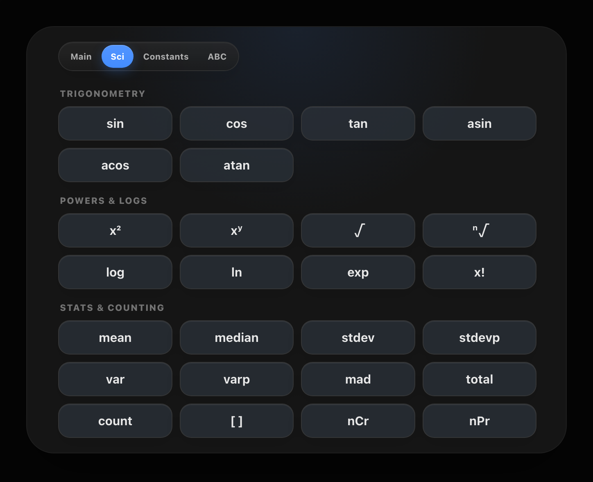
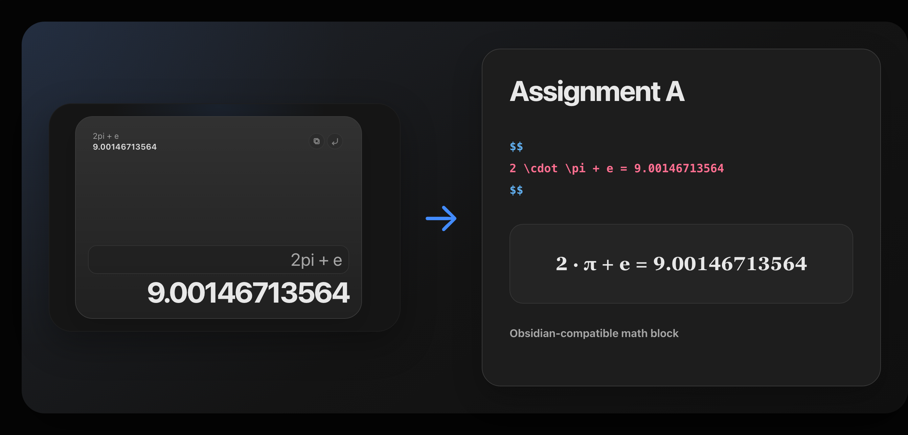

# Calculator Pro

A clean scientific calculator for Obsidian.

Calculator Pro gives you a fast math workspace inside your vault. It supports scientific functions, equation history, and LaTeX export for notes.

## Features

### Scientific calculator

If you have used Desmos Scientific Calculator, this will feel familiar. Calculator Pro supports powers, roots, trigonometry, constants, fractions, complex numbers, statistics, and unit helpers.

### LaTeX Support

Copy equations in LaTeX format for use anywhere, or insert full LaTeX equations directly into your Obsidian notes, including both the expression and the result.

### Clean design

Built with a clean and focused design philosophy, so the calculator stays simple and easy to use.

### Appearance controls

Use **Settings → Calculator Pro → Appearance** to choose an accent color, keep the fixed dark Music Pro-style blue look across Obsidian themes, or enable a soft rainbow accent.

## Commands

Available commands:

- Calculator Pro: Open
- Calculator Pro: Reset

## Installation

### From Obsidian Community Plugins

Once published:

1. Open **Settings → Community plugins**.
2. Search for **Calculator Pro**.
3. Install and enable the plugin.
4. Click the Calculator Pro icon in the left ribbon to open it, or run **Calculator Pro: Open** from the command palette.

## Feedback

Found a bug or have an idea? [Send feedback on Ko-fi](https://ko-fi.com/i/IS6Y120HTC4).

## License

Calculator Pro is released under the [Apache License 2.0](./LICENSE).
